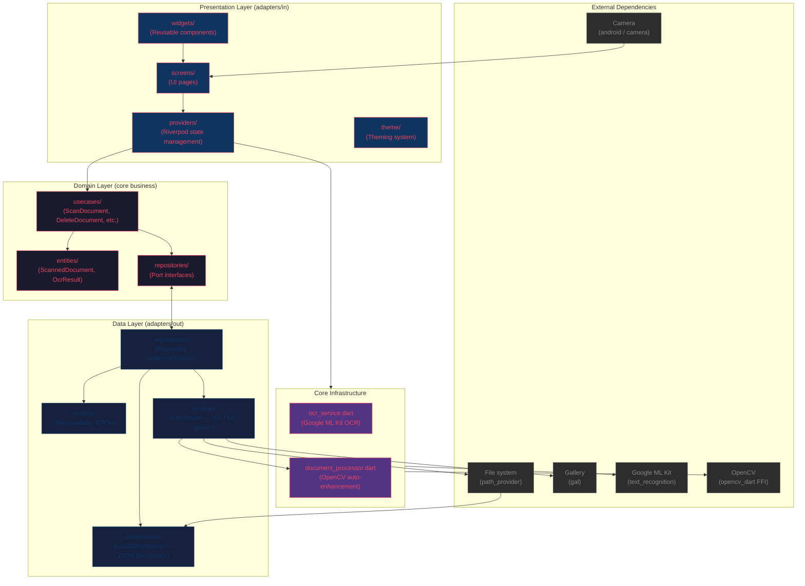

# DocScanner

Multi-theme document scanner for Android with real-time boundary detection, OCR, PDF export, and automatic image enhancement.

## Architecture

Hexagonal (ports & adapters) with strict layer isolation:



### Layer Rules

| Layer | Can import from | Cannot import from |
|-------|----------------|-------------------|
| `domain/` | Dart SDK only, domain entities | `dart:io`, packages, any framework |
| `data/` | Domain interfaces, packages | UI framework (Flutter widgets/riverpod) |
| `presentation/` | Domain entities, providers, `data/` services | Directly |
| `core/` | Any package | UI framework |

- **Domain** has zero external dependencies — pure Dart business logic.
  - Date formatting in entities uses pure Dart instead of `package:intl`.
- **Data** implements domain ports with real I/O (JSON, files, PDF, gallery).
  - A `data/di/` module wires concrete implementations for dependency injection.
- **Presentation** uses Riverpod to coordinate between services and use cases.
- **Core** holds infrastructure services (OCR, boundary detection, image processing).

> Image processing (CLAHE, OTSU, contour detection, perspective warp, enhancement) is extracted to `core/image_processing_service.dart`.

## Tech Stack

| Concern | Library |
|---------|---------|
| State management | Riverpod |
| Camera | `camera` |
| Image processing | `opencv_dart` (FFI) + `image` |
| OCR | `google_mlkit_text_recognition` |
| PDF generation | `pdf` |
| Gallery save | `gal` |
| Persistence | JSON file via `path_provider` |
| Perspective crop | OpenCV `getPerspectiveTransform2f` + `warpPerspective` |
| Boundary detection | OpenCV CLAHE + OTSU + morphology + Canny fallback |
| Themes | 3 themes (Arcade, Kawaii, Professional) |
| App icon | Custom SVG (magnifying glass + document), indigo adaptive icon |

## Project Structure

```
lib/
├── main.dart
├── core/
│   ├── document_boundary_detector.dart  # Live camera boundary detection
│   ├── document_processor.dart          # OpenCV auto-enhance pipeline
│   ├── image_processing_service.dart    # Crop, warp, enhance, encode
│   └── ocr_service.dart                 # Google ML Kit OCR
├── data/
│   ├── datasources/
│   │   └── local_datasource.dart    # JSON file persistence
│   ├── di/
│   │   └── providers.dart           # Dependency injection wiring
│   ├── models/
│   │   └── scanned_document_model.dart
│   ├── repositories/
│   │   └── document_repository_impl.dart
│   └── services/
│       └── file_service.dart        # File I/O, PDF, gallery ops
├── domain/
│   ├── entities/
│   │   ├── ocr_result.dart
│   │   └── scanned_document.dart
│   ├── repositories/
│   │   └── document_repository.dart    # Port interface
│   └── usecases/
│       ├── add_pages_to_document.dart
│       ├── delete_document.dart
│       ├── export_to_pdf.dart
│       ├── get_all_documents.dart
│       ├── remove_page_from_document.dart
│       ├── rename_document.dart
│       └── scan_document.dart
└── presentation/
    ├── providers/
    │   ├── document_provider.dart    # Document list state
    │   ├── ocr_provider.dart         # OCR state
    │   └── theme_provider.dart       # Theme state
    ├── screens/
    │   ├── document_detail_screen.dart  # Page grid + batch delete
    │   ├── home_screen.dart          # Document list + search + batch
    │   ├── onboarding_screen.dart    # First-run carousel
    │   ├── multi_page_review_screen.dart  # Multi-page review, reorder, edit, save
    │   ├── preview_screen.dart            # Crop + OCR + enhance
    │   └── scanner_screen.dart            # Camera capture + auto-detect + multi-page
    ├── theme/
    │   └── themes.dart               # Arcade / Kawaii / Professional
    └── widgets/
        ├── document_actions_sheet.dart
        ├── document_card.dart
        └── shimmer_grid.dart
```

## Features

- **Boundary detection**: Real-time document detection in camera preview via OpenCV (Y-plane → downsample → CLAHE → OTSU → morphology → minAreaRect). Adaptive Canny fallback for edge-based detection. Bright scene detection with specialized low thresholds for light-on-light scenarios.
- **Perspective correction**: OpenCV `getPerspectiveTransform2f` + `warpPerspective`
- **Image enhancement**: Two modes selected before capture:
  - **B&W**: Grayscale + NORM_MINMAX normalization + contrast boost (α=1.25, β=5) + sharpen kernel
  - **Color**: Preserved colors + gentle contrast (α=1.1, β=5) + sharpen kernel
- **Manual corner adjustment**: Draggable handles with magnifier (4× digital zoom) for fine-tuning crop
- **Torch**: Flashlight toggle in scanner AppBar for low-light document scanning; turns off automatically on screen exit
- **Multi-page scan (always on)**: Capture multiple pages in sequence without leaving the scanner; auto-processes each page (crop + enhance, no PreviewScreen detour); live thumbnail strip with page count; "Done" button opens review screen for reorder, edit, delete, and save as a single multi-page document
- **Color mode persistence**: Choice of color/B&W persists across pages during a scanning session; toggle is in the scanner (pre-capture), not post-processing
- **PDF-first**: Dynamic page format per image aspect ratio, regenerates on page add/remove
- **OCR**: Google ML Kit text recognition with copy-to-clipboard
- **Search & batch**: Filter documents by name, multi-select delete, batch page management
- **Page management**: View/delete individual pages within multi-page documents
- **Image caching**: `cacheWidth` on all thumbnails (400px cards, 120px reorder) to prevent full-resolution decode
- **3 themes**: Arcade (neon retro), Kawaii (pastel cute), Professional (clean)
- **Onboarding**: 4-page first-run carousel with fade transitions, persisted via SharedPreferences
- **Gallery save**: JPG saved to phone gallery automatically
- **Share**: PDF with document name as filename (copied to temp dir before sharing)

## Issues Fixed

24 actionable production-readiness issues resolved:

| # | Issue | Status |
|---|-------|--------|
| #65 | Theme flash on app start (FadeTransition + ValueKey) | ✅ Fixed |
| #41 | `setState` every 10th frame even when corners unchanged (`_cornersEqual`) | ✅ Fixed |
| #40 | `File.existsSync` on UI thread → `Image.file` errorBuilder | ✅ Fixed |
| #39 | Image processing coupled to UI → extracted to service | ✅ Fixed |
| #57 | ShimmerGrid missing `RepaintBoundary` | ✅ Fixed |
| #54 | Empty catch blocks → added `debugPrint` | ✅ Fixed |
| #45 | Double memory load (two OpenCV decodes) → single decode | ✅ Fixed |
| #62 | Underscore params → `_` wildcard | ✅ Fixed |
| #61 | Onboarding transitions | ✅ Fixed |
| #47 | textScaleFactor clamp | ✅ Fixed |
| #59 | ProGuard rules | ✅ Fixed |
| #58 | Strict lint rules → 0 analyze errors | ✅ Fixed |
| #51 | `mounted` checks | ✅ Fixed |
| #46 | FileService SRP split | ✅ Fixed |
| #56 | OCR provider consolidation | ✅ Fixed |
| #84 | Unreliable auto-capture | ✅ Removed |
| #86 | PDF sharing filename on Android (FileProvider ignores XFile name) | ✅ Fixed |
| #50 | No image caching (`cacheWidth` on Image.file calls) | ✅ Fixed |
| #42 | Zero widget tests → 47 presentation tests, 80 total | ✅ Fixed |
| #88 | Poor edge detection on light backgrounds (adaptive Canny thresholds) | ✅ Fixed |
| #89 | Missing app icon (magnifying glass + document SVG) | ✅ Fixed |
| #90 | Color mode toggle in post-processing (moved to scanner, persisted) | ✅ Fixed |
| #93 | Torch toggle (FlashMode.torch in scanner AppBar) | ✅ Fixed |
| #94 | Multi-page scan with thumbnail strip and review screen | ✅ Fixed |

## Remaining

| # | Issue | Severity |
|---|-------|----------|
| #93 | Pinch-to-zoom, page re-scan | 🟡 MEDIUM |
| #52 | Adaptive tablet/landscape layout | 🟡 MEDIUM |
| #49 | Golden tests (2 pending on-device regeneration); camera integration test mocked but skipped (needs native test harness) | 🟡 MEDIUM |
| #48 | Anemic domain model (business logic in UI) | 🟡 MEDIUM |

## Testing

```
flutter test
```

105 tests (5 skipped on host — require native OpenCV lib or camera hardware):
- 40 domain + data layer tests (entities, models, repositories, use cases)
- 7 core infrastructure tests (OCR + OpenCV auto-enhance)
- 58 presentation tests (6 screens, 4 widgets, golden)
- 0 flutter analyze errors

> New features should include widget and unit tests.

## Build

```sh
# Debug APK
flutter build apk --debug --target-platform android-arm64

# Release APK (with ABI splits + minification)
flutter build apk --release
```
