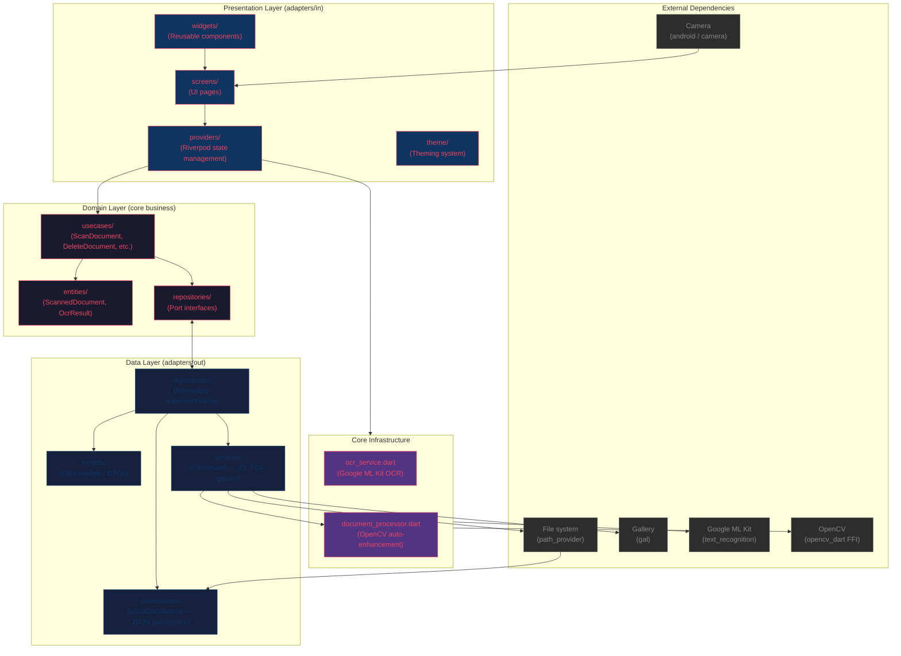

# DocScanner

Multi-theme document scanner for Android with OCR, PDF export, and automatic image enhancement.

## Architecture

Hexagonal (ports & adapters) with strict layer isolation:



### Layer Rules

| Layer | Can import from | Cannot import from |
|-------|----------------|-------------------|
| `domain/` | Dart SDK only, domain entities | `dart:io`, packages, any framework |
| `data/` | Domain interfaces, packages | UI framework (Flutter widgets/riverpod) |
| `presentation/` | Domain entities, providers, `data/` services | Directly |
| `core/` | Any package | UI framework |

- **Domain** has zero external dependencies — pure Dart business logic
- **Data** implements domain ports with real I/O (JSON, files, PDF, gallery)
- **Presentation** uses Riverpod to coordinate between services and use cases
- **Core** holds infrastructure services (OCR, image processing)

## Tech Stack

| Concern | Library |
|---------|---------|
| State management | Riverpod |
| Camera | `camera` |
| Image processing | `opencv_dart` (FFI) + `image` |
| OCR | `google_mlkit_text_recognition` |
| PDF generation | `pdf` |
| Gallery save | `gal` |
| Persistence | JSON file via `path_provider` |
| Image crop | `flutter_image_perspective_crop` |
| Themes | 3 themes (Arcade, Kawaii, Professional) |

## Project Structure

```
lib/
├── main.dart
├── core/
│   ├── document_processor.dart    # OpenCV auto-enhance pipeline
│   └── ocr_service.dart           # Google ML Kit OCR
├── data/
│   ├── datasources/
│   │   └── local_datasource.dart  # JSON file persistence
│   ├── models/
│   │   └── scanned_document_model.dart
│   ├── repositories/
│   │   └── document_repository_impl.dart
│   └── services/
│       └── file_service.dart      # File I/O, PDF, gallery ops
├── domain/
│   ├── entities/
│   │   ├── ocr_result.dart
│   │   └── scanned_document.dart
│   ├── repositories/
│   │   └── document_repository.dart  # Port interface
│   └── usecases/
│       ├── add_pages_to_document.dart
│       ├── delete_document.dart
│       ├── export_to_pdf.dart
│       ├── get_all_documents.dart
│       ├── rename_document.dart
│       └── scan_document.dart
└── presentation/
    ├── providers/
    │   ├── document_provider.dart    # Document list state
    │   ├── ocr_provider.dart         # OCR state
    │   └── theme_provider.dart       # Theme state
    ├── screens/
    │   ├── home_screen.dart          # Document list + search + batch
    │   ├── onboarding_screen.dart    # First-run carousel
    │   ├── preview_screen.dart       # Crop + OCR
    │   └── scanner_screen.dart       # Camera capture
    ├── theme/
    │   └── themes.dart               # Arcade / Kawaii / Professional
    └── widgets/
        ├── document_actions_sheet.dart
        ├── document_card.dart
        └── shimmer_grid.dart
```

## Features

- **Auto-enhance**: OpenCV OTSU binarization + deskew on every scan
- **PDF-first**: Generates PDF immediately after crop, regenerates on page add
- **OCR**: Google ML Kit text recognition with copy-to-clipboard
- **Search & batch**: Filter documents by name, multi-select delete
- **Pull-to-refresh**: Refresh document list
- **3 themes**: Arcade (neon retro), Kawaii (pastel cute), Professional (clean)
- **Onboarding**: 4-page first-run carousel persisted via SharedPreferences
- **Gallery save**: JPG saved to phone gallery automatically
- **Share**: Shares PDF when available, falls back to JPG

## Testing

```
flutter test
```

37 tests (4 skipped on host — require native OpenCV lib present on device):
- Entity serialization tests
- Repository implementation tests
- Use case orchestration tests
- OCR service tests
- Document model roundtrip tests

## Build

```sh
# Debug APK
flutter build apk --debug --target-platform android-arm64

# Release APK (with ABI splits + minification)
flutter build apk --release
```
