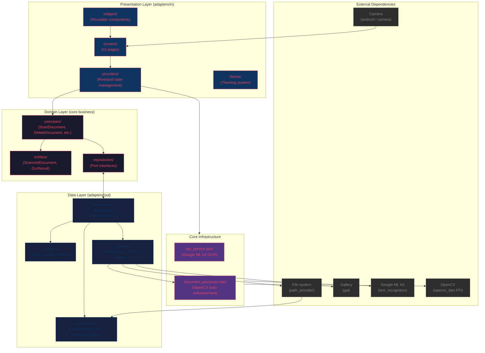

# DocScanner

Multi-theme document scanner for Android with real-time boundary detection, auto-capture, OCR, PDF export, and automatic image enhancement.

## Architecture

Hexagonal (ports & adapters) with strict layer isolation:



### Layer Rules

| Layer | Can import from | Cannot import from |
|-------|----------------|-------------------|
| `domain/` | Dart SDK only, domain entities | `dart:io`, packages, any framework |
| `data/` | Domain interfaces, packages | UI framework (Flutter widgets/riverpod) |
| `presentation/` | Domain entities, providers, `data/` services | Directly |
| `core/` | Any package | UI framework |

- **Domain** has zero external dependencies — pure Dart business logic.
  - Date formatting in entities uses pure Dart instead of `package:intl`.
- **Data** implements domain ports with real I/O (JSON, files, PDF, gallery).
  - A `data/di/` module wires concrete implementations for dependency injection.
- **Presentation** uses Riverpod to coordinate between services and use cases.
- **Core** holds infrastructure services (OCR, boundary detection, image processing).

> Image processing (CLAHE, OTSU, contour detection, perspective warp, enhancement) is extracted to `core/image_processing_service.dart`.

## Tech Stack

| Concern | Library |
|---------|---------|
| State management | Riverpod |
| Camera | `camera` |
| Image processing | `opencv_dart` (FFI) + `image` |
| OCR | `google_mlkit_text_recognition` |
| PDF generation | `pdf` |
| Gallery save | `gal` |
| Persistence | JSON file via `path_provider` |
| Perspective crop | OpenCV `getPerspectiveTransform2f` + `warpPerspective` (replaced `flutter_image_perspective_crop`) |
| Boundary detection | OpenCV OTSU + morphology + minAreaRect (preview + photo) |
| Themes | 3 themes (Arcade, Kawaii, Professional) |

## Project Structure

```
lib/
├── main.dart
├── core/
│   ├── document_boundary_detector.dart  # Live camera boundary detection
│   ├── document_processor.dart          # OpenCV auto-enhance pipeline
│   ├── image_processing_service.dart    # Crop, warp, enhance, encode
│   └── ocr_service.dart                 # Google ML Kit OCR
├── data/
│   ├── datasources/
│   │   └── local_datasource.dart    # JSON file persistence
│   ├── di/
│   │   └── providers.dart           # Dependency injection wiring
│   ├── models/
│   │   └── scanned_document_model.dart
│   ├── repositories/
│   │   └── document_repository_impl.dart
│   └── services/
│       └── file_service.dart        # File I/O, PDF, gallery ops
├── domain/
│   ├── entities/
│   │   ├── ocr_result.dart
│   │   └── scanned_document.dart
│   ├── repositories/
│   │   └── document_repository.dart    # Port interface
│   └── usecases/
│       ├── add_pages_to_document.dart
│       ├── delete_document.dart
│       ├── export_to_pdf.dart
│       ├── get_all_documents.dart
│       ├── remove_page_from_document.dart
│       ├── rename_document.dart
│       └── scan_document.dart
└── presentation/
    ├── providers/
    │   ├── document_provider.dart    # Document list state
    │   ├── ocr_provider.dart         # OCR state
    │   └── theme_provider.dart       # Theme state
    ├── screens/
    │   ├── document_detail_screen.dart  # Page grid + batch delete
    │   ├── home_screen.dart          # Document list + search + batch
    │   ├── onboarding_screen.dart    # First-run carousel
    │   ├── preview_screen.dart       # Crop + OCR + enhance
    │   └── scanner_screen.dart       # Camera capture + auto-detect
    ├── theme/
    │   └── themes.dart               # Arcade / Kawaii / Professional
    └── widgets/
        ├── document_actions_sheet.dart
        ├── document_card.dart
        └── shimmer_grid.dart
```

## Features

- **Auto-capture + boundary detection**: Real-time document detection in camera preview (Y-plane → downsample → CLAHE → OTSU → morphology → minAreaRect). Adaptive Canny fallback. Auto-captures after 5 consecutive detections.
- **Perspective correction**: OpenCV `getPerspectiveTransform2f` + `warpPerspective` (bypasses JPEG DNL bug in `flutter_image_perspective_crop`)
- **Image enhancement**: normalize(NORM_MINMAX) + contrast boost (α=1.25, β=5) + sharpen kernel center 5 for clean scan-like output. Color mode toggle (B&W enhanced or original color).
- **Manual corner adjustment**: Draggable handles with magnifier (GPU-accelerated `_MagnifierPainter`, 4× digital zoom)
- **PDF-first**: Dynamic page format per image aspect ratio, regenerates on page add/remove
- **OCR**: Google ML Kit text recognition with copy-to-clipboard (labeled "Extract Text" for UX)
- **Search & batch**: Filter documents by name, multi-select delete
- **Page management**: View/delete individual pages within multi-page documents
- **Pull-to-refresh**: Refresh document list
- **3 themes**: Arcade (neon retro), Kawaii (pastel cute), Professional (clean)
- **Onboarding**: 4-page first-run carousel persisted via SharedPreferences
- **Gallery save**: JPG saved to phone gallery automatically
- **Share**: Shares PDF when available, falls back to JPG

## Testing

```
flutter test
```

60 tests (4 skipped on host — require native OpenCV lib present on device):
- Entity serialization tests
- Repository implementation tests
- Use case orchestration tests
- OCR service tests
- Document model roundtrip tests
- Widget tests for all 5 screens (Onboarding, Home, Scanner, Preview, DocumentDetail)
- Corner drag unit tests
- Boundary detector tests (require OpenCV native lib)

> New features should include widget and unit tests.

## Build

```sh
# Debug APK
flutter build apk --debug --target-platform android-arm64

# Release APK (with ABI splits + minification)
flutter build apk --release
```
