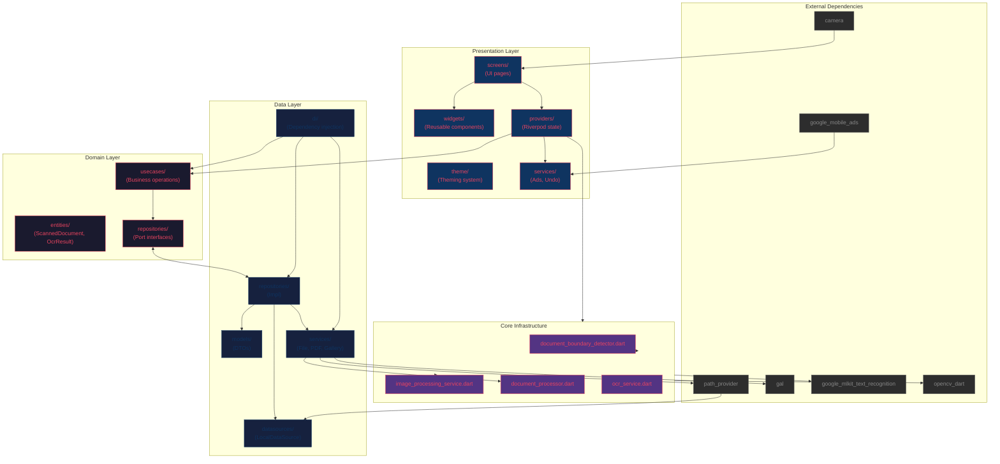
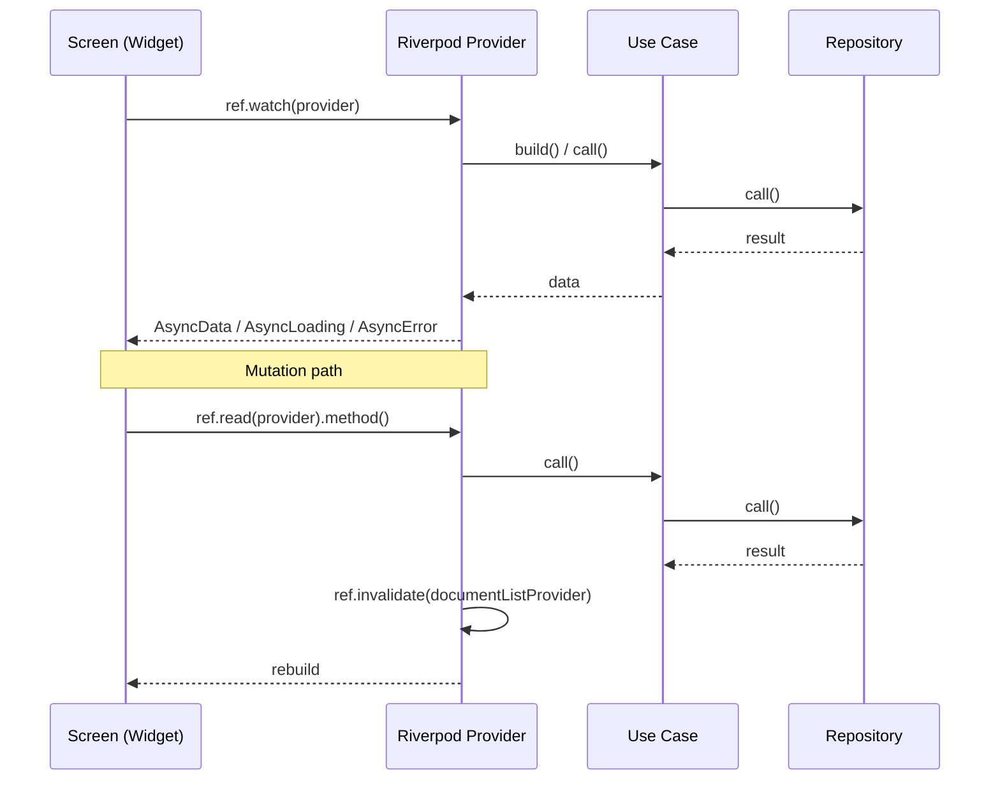
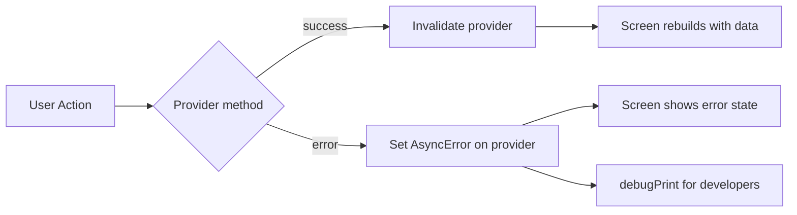
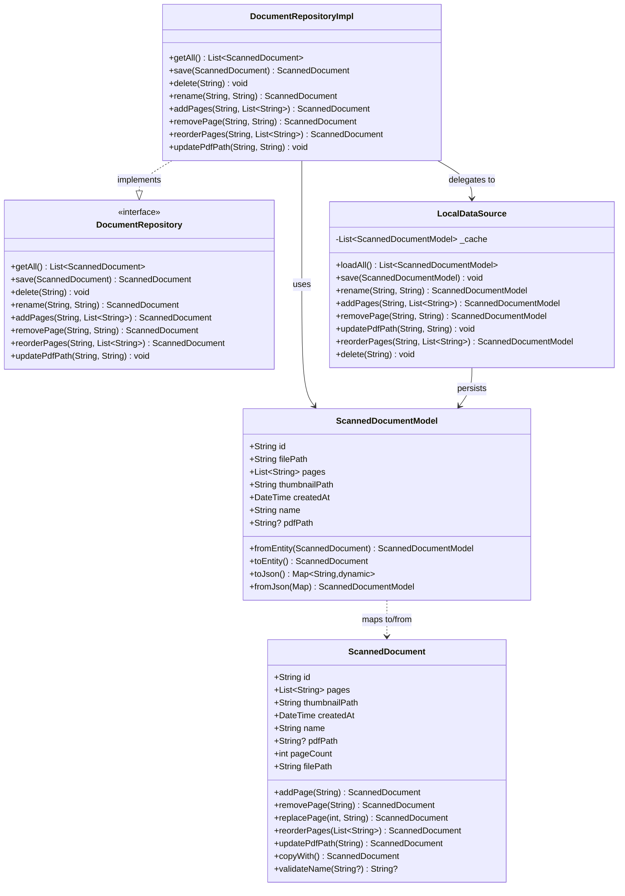

# DocScanner Architecture

> Repository-specific architecture documentation.
> Last updated: 2026-06-02

---

## High-Level Architecture



## Layer Responsibilities

### Domain Layer (`lib/domain/`)

The innermost layer with zero dependencies on Flutter or any external package.

**Entities** (`entities/`):
- `ScannedDocument` — Core domain model representing a scanned document with pages, name, dates, and PDF path.
- `OcrResult` / `OcrBlock` — OCR recognition results.

**Ports** (`repositories/`):
- `DocumentRepository` — CRUD operations for scanned documents.
- `DocumentDataSource` — Lower-level data source abstraction.
- `FileStorage` — Save page images and thumbnails.
- `GallerySaver` — Save to device gallery.
- `PdfGenerator` — Generate and export PDFs.
- `OcrTextRecognizer` — Text recognition abstraction.

**Use Cases** (`usecases/`):
- `ScanDocument` — Create a single-page document.
- `GetAllDocuments` — List all documents.
- `DeleteDocument` — Remove a document.
- `RenameDocument` — Rename a document.
- `AddPagesToDocument` — Append pages to existing document.
- `RemovePageFromDocument` — Remove a specific page.
- `ExportToPdf` — Collect page paths for PDF export.

### Data Layer (`lib/data/`)

Implements domain ports with real I/O operations.

**Datasource** (`datasources/`):
- `LocalDataSource` — JSON file persistence with in-memory cache. Reads/writes `documents/index.json` in app documents directory.

**Models** (`models/`):
- `ScannedDocumentModel` — JSON-serializable DTO with `fromJson`/`toJson` and `fromEntity`/`toEntity` mappers.

**Repository Implementation** (`repositories/`):
- `DocumentRepositoryImpl` — Delegates to `LocalDataSource`, maps between models and entities.

**Services** (`services/`):
- `FileService` — Saves page images and thumbnails to disk (implements `FileStorage`).
- `PdfService` — Generates PDFs with per-image aspect ratio (implements `PdfGenerator`).
- `GalleryService` — Saves images to device gallery via `gal` package (implements `GallerySaver`).

**DI** (`di/`):
- `providers.dart` — Wires all Riverpod providers for repository, services, and use cases.

### Presentation Layer (`lib/presentation/`)

Flutter UI with Riverpod state management.

**Screens** (`screens/`):
- `HomeScreen` — Document grid with search, batch mode, themes, PDF export.
- `ScannerScreen` — Camera preview with real-time boundary detection, capture, multi-page.
- `PreviewScreen` — Crop adjustment with draggable corners, magnifier, OCR trigger.
- `DocumentDetailScreen` — Page grid with reorder, batch delete, add page.
- `MultiPageReviewScreen` — Review captured pages before saving.
- `OnboardingScreen` — First-run carousel (4 pages).
- `HelpScreen` — Feature descriptions and links.

**Providers** (`providers/`):
- `theme_provider.dart` — Theme selection and mode (light/dark/system).
- `document_provider.dart` — Document list async state.
- `document_scan_provider.dart` — Scan orchestration (save, PDF, gallery, invalidation).
- `document_export_provider.dart` — Bulk PDF export.
- `document_page_provider.dart` — Page management (add, remove, reorder).
- `document_admin_provider.dart` — Delete, restore, rename.
- `ocr_provider.dart` — OCR state.

**Services** (`services/`):
- `ad_service.dart` — Google Mobile Ads banner and native ad lifecycle.
- `undo_service.dart` — Undo action state (used for delete restoration).

**Theme** (`theme/`):
- `themes.dart` — Three complete Material 3 themes: Arcade (neon retro), Kawaii (pastel), Professional (corporate).

**Widgets** (`widgets/`):
- `DocumentCard` — Grid card with thumbnail, name, page count, selection state.
- `DocumentActionsSheet` — Bottom sheet with rename, add page, share, delete actions.
- `BannerAdWidget` — Banner ad container.
- `PostSaveAdCard` — Native ad card shown after saving.
- `ShimmerGrid` — Loading skeleton with animated shimmer.
- `ResponsiveUtils` — Cross-axis count helper (2/3/4 columns).

### Core Layer (`lib/core/`)

Infrastructure services that bridge to native/platform capabilities.

- `document_boundary_detector.dart` — Real-time document boundary detection from camera Y-plane using OpenCV (CLAHE + OTSU + morphology + Canny fallback).
- `document_processor.dart` — Auto-enhance pipeline (deskew + OTSU threshold).
- `image_processing_service.dart` — Complete image processing: corner detection, perspective transform, enhance (B&W/color), encode.
- `ocr_service.dart` — Google ML Kit OCR wrapper with `OcrTextRecognizer` protocol.

---

## Dependency Rules

### Allowed Dependencies

| Source Layer | Can Import |
|-------------|------------|
| `domain/` | Dart SDK only |
| `data/` | `domain/`, `package:*` (external packages) |
| `core/` | `domain/`, `package:*` (external packages) |
| `presentation/` | `domain/`, `core/`, `data/di/`, `package:flutter`, `package:flutter_riverpod` |
| `test/` | All layers, `package:flutter_test`, `package:mocktail` |

### Forbidden Dependencies

| Source Layer | Cannot Import |
|-------------|---------------|
| `domain/` | `dart:io`, `dart:html`, any package, Flutter |
| `data/` | Flutter widgets, Riverpod, Flutter framework |
| `core/` | Flutter widgets |
| `presentation/` | `data/datasources/`, `data/models/` directly (go through repositories) |

---

## Module Boundaries

### Document Creation Flow

```
ScannerScreen
  └─ capture() → CameraController.takePicture()
      └─ ImageProcessingService.detectDocumentFromMat()
      └─ ImageProcessingService.processScan()
      └─ PreviewScreen (optional edit)
          └─ processScan() with adjusted corners
      └─ MultiPageReviewScreen (reorder, edit, delete pages)
          └─ onSave → DocumentScan.scanFromMultipleBytes()
              └─ FileService.savePageImage() + saveThumbnail()
              └─ ScanDocument use case → DocumentRepository.save()
              └─ PdfService.generatePdf()
              └─ GalleryService.saveToGallery()
              └─ ref.invalidate(documentListProvider)
```

### Document Viewing Flow

```
HomeScreen
  └─ DocumentListNotifier.build() → GetAllDocuments use case
      └─ DocumentRepository.getAll()
          └─ LocalDataSource.loadAll()
  └─ GridView of DocumentCard widgets
      └─ onTap → showDocumentActionsSheet
          └─ Rename / Add Page / Share / Delete / View Pages
```

---

## Data Flow

### Read Path

```
Screen → ref.watch(provider) → UseCase → Repository (interface) → RepositoryImpl → DataSource → JSON file → Model → Entity → Provider → Screen rebuild
```

### Write Path

```
Screen → ref.read(provider).method() → UseCase → Repository (interface) → RepositoryImpl → DataSource → JSON file → Model → Entity → Provider invalidation → Screen rebuild
```

---

## State Management Flow



---

## Error Handling Flow



- Providers catch errors and expose them via `AsyncValue.error`.
- Screens use `.when(loading, error, data)` to render appropriate UI.
- `ScaffoldMessenger.of(context).showSnackBar()` for transient error feedback.
- `debugPrint()` for development logging (replaced by proper logger in future).

---

## Feature Creation Blueprint

### Example: Creating a "Favorite Documents" feature

1. **Domain layer**:
   - Add `isFavorite` field to `ScannedDocument` entity.
   - Add `toggleFavorite` method to `DocumentRepository` interface.
   - Create `ToggleFavoriteDocument` use case.

2. **Data layer**:
   - Add `isFavorite` to `ScannedDocumentModel` with JSON serialization.
   - Implement `toggleFavorite` in `LocalDataSource`.
   - Implement `toggleFavorite` in `DocumentRepositoryImpl`.
   - Wire `ToggleFavoriteDocument` in `data/di/providers.dart`.

3. **Core layer**: (not needed for this feature)

4. **Presentation layer**:
   - Add favorite icon to `DocumentCard`.
   - Add toggle action to `DocumentActionsSheet`.
   - Update `HomeScreen` to filter by favorites if needed.

5. **Tests**:
   - Update `ScannedDocumentModelTest` for new field.
   - Update `DocumentRepositoryImplTest`.
   - Add `ToggleFavoriteDocumentTest`.
   - Update `DocumentCardTest` and `HomeScreenTest`.

---

## Document Relationship Diagram


