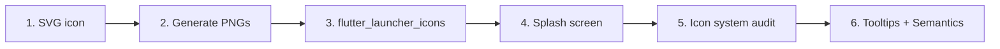

# Visual Redesign Implementation Plan — DocScanner

**Status:** Draft
**Target:** App icon, splash screen, iconography system
**Priority:** P0 (icon + splash) ← todo antes de Play Store

---

## 1. App Icon — "Fold & Focus" (P0)

### 1.1 New SVG Source

Reemplazar `assets/icon/icon.svg`:

```xml
<svg xmlns="http://www.w3.org/2000/svg" viewBox="0 0 1024 1024" width="1024" height="1024">
  <defs>
    <linearGradient id="bgGrad" x1="0%" y1="0%" x2="100%" y2="100%">
      <stop offset="0%" stop-color="#1A5276"/>
      <stop offset="100%" stop-color="#0D1B2A"/>
    </linearGradient>
    <linearGradient id="focusGlow" x1="0%" y1="0%" x2="100%" y2="100%">
      <stop offset="0%" stop-color="#00E5FF" stop-opacity="0.3"/>
      <stop offset="100%" stop-color="#00E5FF" stop-opacity="0"/>
    </linearGradient>
    <filter id="shadow" x="-5%" y="-5%" width="115%" height="115%">
      <feDropShadow dx="0" dy="4" stdDeviation="12" flood-color="#000" flood-opacity="0.25"/>
    </filter>
  </defs>

  <!-- Background -->
  <rect width="1024" height="1024" rx="224" fill="url(#bgGrad)"/>

  <!-- Document body (slightly rotated for dynamism) -->
  <g transform="translate(512,512) rotate(-4) translate(-462,-562)">
    <rect x="0" y="0" width="700" height="900" rx="32" fill="#FFFFFF" filter="url(#shadow)"/>
    <!-- Fold top-right corner -->
    <path d="M0 0 L224 0 L224 224 Q224 260 260 260 L700 260" fill="#FFFFFF" filter="url(#shadow)"/>
    <path d="M0 0 L224 0 L224 224 Q224 260 260 260 L700 260 L700 900 L0 900 Z" fill="#FFFFFF"/>
    <!-- Fold triangle -->
    <path d="M224 0 L224 224 Q224 260 260 260" fill="#F0F0F5"/>
    <path d="M224 0 L224 224 Q224 242 242 254 L448 0 Z" fill="#E8EDF2"/>
    <!-- Text lines -->
    <rect x="72" y="180" width="360" height="16" rx="8" fill="#D0D5DD"/>
    <rect x="72" y="232" width="480" height="16" rx="8" fill="#D0D5DD"/>
    <rect x="72" y="284" width="320" height="16" rx="8" fill="#D0D5DD"/>
    <rect x="72" y="336" width="440" height="16" rx="8" fill="#D0D5DD"/>
    <rect x="72" y="388" width="280" height="16" rx="8" fill="#D0D5DD"/>
  </g>

  <!-- Focus circle overlay -->
  <circle cx="460" cy="440" r="200" fill="url(#focusGlow)"/>
  <circle cx="460" cy="440" r="160" fill="none" stroke="#00E5FF" stroke-width="8" stroke-opacity="0.4"/>
  <circle cx="460" cy="440" r="80" fill="none" stroke="#00E5FF" stroke-width="12"/>
  <circle cx="460" cy="440" r="8" fill="#00E5FF"/>
  <!-- Crosshair thin lines -->
  <line x1="460" y1="300" x2="460" y2="360" stroke="#00E5FF" stroke-width="4" stroke-opacity="0.6"/>
  <line x1="460" y1="520" x2="460" y2="580" stroke="#00E5FF" stroke-width="4" stroke-opacity="0.6"/>
  <line x1="320" y1="440" x2="380" y2="440" stroke="#00E5FF" stroke-width="4" stroke-opacity="0.6"/>
  <line x1="540" y1="440" x2="600" y2="440" stroke="#00E5FF" stroke-width="4" stroke-opacity="0.6"/>
</svg>
```

### 1.2 Generate PNG Assets

```bash
# Convert SVG to PNG at 1024×1024 (App Store requires this size)
# Use Inkscape, cairosvg, or any SVG renderer:
# inkscape -w 1024 -h 1024 assets/icon/icon.svg -o assets/icon/icon.png
# Then regenerate launcher icons:
flutter pub run flutter_launcher_icons:main
```

### 1.3 Update Adaptive Icon Background

```xml
<!-- android/app/src/main/res/values/colors.xml -->
<color name="ic_launcher_background">#1A5276</color>
```

### 1.4 Generate All mipmap Densities

`flutter pub run flutter_launcher_icons:main` hará esto automáticamente. Verificar que los 5 densidades se generen (mdpi a xxxhdpi).

---

## 2. Splash Screen (P0)

### 2.1 Android Native Splash

Reemplazar los drawables de splash:

```xml
<!-- android/app/src/main/res/drawable/launch_background.xml -->
<?xml version="1.0" encoding="utf-8"?>
<layer-list xmlns:android="http://schemas.android.com/apk/res/android">
  <!-- Background color -->
  <item android:drawable="@color/ic_launcher_background"/>
  <!-- Centered icon -->
  <item
      android:width="96dp"
      android:height="96dp"
      android:gravity="center"
      android:drawable="@drawable/ic_launcher_foreground"/>
</layer-list>
```

```xml
<!-- android/app/src/main/res/drawable-v21/launch_background.xml -->
<?xml version="1.0" encoding="utf-8"?>
<layer-list xmlns:android="http://schemas.android.com/apk/res/android">
  <item android:drawable="@android:color/ic_launcher_background"/>
  <item
      android:width="96dp"
      android:height="96dp"
      android:gravity="center"
      android:drawable="@drawable/ic_launcher_foreground"/>
</layer-list>
```

### 2.2 Flutter Native Splash (Alternative)

Si se prefiere la versión con `flutter_native_splash`:

```yaml
# pubspec.yaml
dev_dependencies:
  flutter_native_splash: ^2.4.0

# flutter_native_splash config
flutter_native_splash:
  color: "#1A5276"
  image: assets/icon/icon.png
  android: true
  ios: true
  android_gravity: center
  android_12:
    color: "#1A5276"
    image: assets/icon/icon.png
```

```bash
flutter pub run flutter_native_splash:create
```

**Recomendación:** Usar `flutter_native_splash` — genera SplashScreen API para Android 12+ y es mantenible desde un solo lugar.

---

## 3. Iconography System (P1)

### 3.1 Theme-Aware Icon Selection

Modificar `lib/presentation/theme/themes.dart` para exponer un helper de icon style por tema:

```dart
enum IconStyle { outlined, rounded, sharp }

IconStyle iconStyleFor(AppTheme theme) => switch (theme) {
  AppTheme.professional => IconStyle.outlined,
  AppTheme.arcade      => IconStyle.sharp,    // más gruesos, sólidos
  AppTheme.kawaii      => IconStyle.rounded,  // más redondeados, suaves
};
```

Cuando se requiera cambiar el icon set por tema, usar:

```dart
IconData _scanIcon(BuildContext context) {
  final theme = ref.watch(themeProvider);
  return switch (iconStyleFor(theme)) {
    IconStyle.outlined => Icons.document_scanner_outlined,
    IconStyle.rounded  => Icons.document_scanner_rounded,
    IconStyle.sharp    => Icons.document_scanner,
  };
}
```

### 3.2 Cuándo aplicar

Esto es prioritario solo para los iconos más visibles:
- FAB icon (scan)
- AppBar action icons
- Empty state icon

Para el 90% de los iconos internos (Material defaults), el outlined estándar es suficiente.

### 3.3 Tooltips Obligatorios

Regla: **todo `IconButton` debe tener `tooltip`**. Audit de los que faltan en `scanner_screen.dart`:

| Línea | IconButton | Tooltip actual |
|-------|-----------|----------------|
| scanner_screen | Torch toggle | ✅ `l10n.torchOff` / `l10n.torchOn` |
| scanner_screen | Color/BW toggle | ❌ Falta — añadir `l10n.bwMode` / `l10n.colorMode` |
| scanner_screen | Done scanning | ❌ Falta — añadir `l10n.doneScanning` |

### 3.4 Semantic Labels para Accesibilidad

Añadir `Semantics` wrapper a iconos críticos:

```dart
Semantics(
  label: l10n.scanADocument,
  button: true,
  child: FloatingActionButton.extended(...),
)
```

---

## 4. Implementation Order



### Sprint 1 (Día 1)
- `assets/icon/icon.svg` → nuevo diseño
- `flutter pub run flutter_launcher_icons:main`
- `flutter_native_splash` config + generate
- Actualizar `colors.xml`

### Sprint 2 (Día 2)
- Añadir `iconStyleFor()` en `themes.dart`
- Reemplazar icons más visibles según tema
- Añadir tooltips faltantes
- Añadir `Semantics` a botones principales

---

## 5. Files Changed Summary

| File | Change |
|------|--------|
| `assets/icon/icon.svg` | Nuevo diseño Fold & Focus |
| `assets/icon/icon.png` | Regenerado desde SVG |
| `android/.../res/values/colors.xml` | `#1A5276` |
| `android/.../res/drawable/launch_background.xml` | Icono centrado sobre fondo |
| `android/.../res/drawable-v21/launch_background.xml` | Igual para dark mode |
| `android/.../res/mipmap-*` | Regenerado por launcher_icons |
| `android/.../res/drawable-*/ic_launcher_foreground.png` | Regenerado |
| `pubspec.yaml` | `flutter_native_splash` dev dep |
| `lib/presentation/theme/themes.dart` | `iconStyleFor()` helper |
| `lib/presentation/screens/scanner_screen.dart` | Tooltips faltantes |
| `lib/presentation/screens/home_screen.dart` | Icon style según tema (FAB) |

---

## 6. Verification

```bash
# 1. Icon generation
flutter pub run flutter_launcher_icons:main

# 2. Splash generation
flutter pub run flutter_native_splash:create

# 3. Verify everything compiles
flutter analyze

# 4. Run all tests (golden tests will need updating)
flutter test --update-goldens

# 5. Deploy to device and verify splash + icon
flutter run
```

After deployment, check:
- Home screen launcher icon matches new design
- Splash screen shows icon centered on `#1A5276` background
- No white flash before splash
- FAB icon changes with theme
- All tooltips visible on long-press
